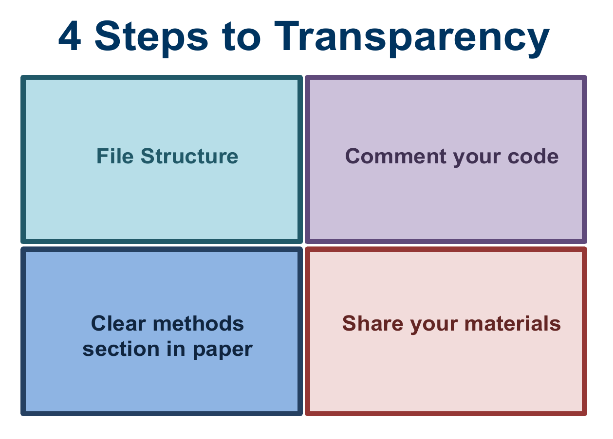
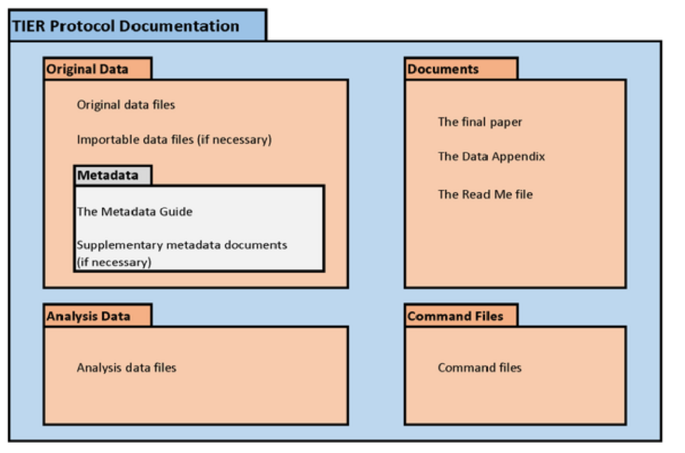
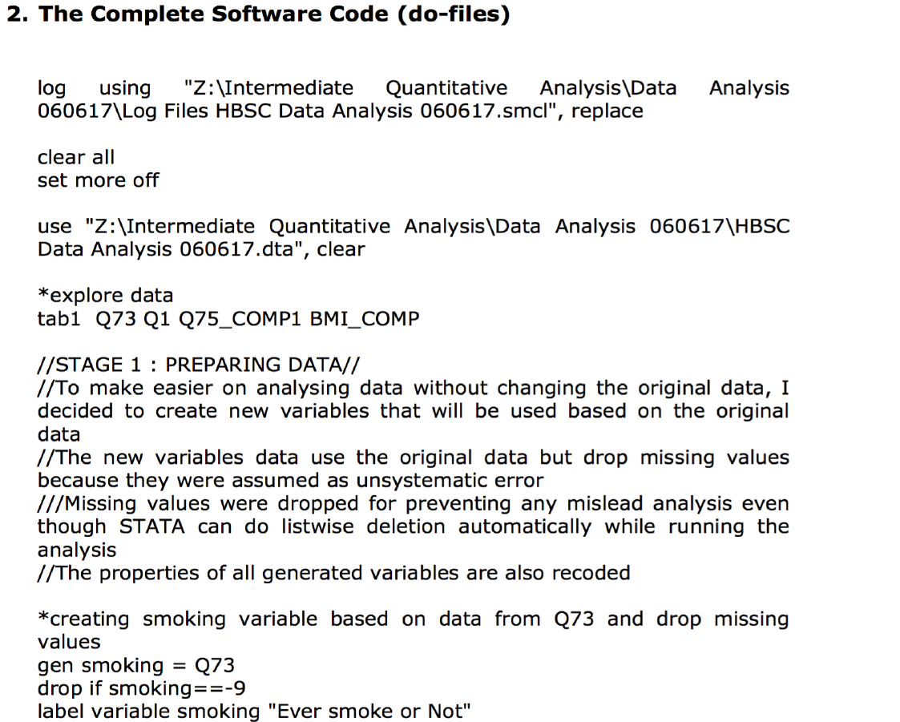
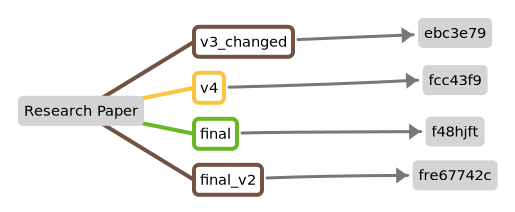
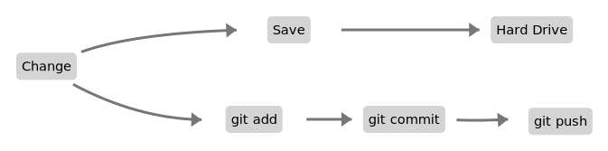

## Introduction

Special Thanks to Oscar Barriga-Cabanillas and Matthieu Stigler!

- Welcome!
  - Training 5: Transparency and Reproducibility in Research 
  - Training 6: Data Management (You are here.)
  - Training 6a: Dynamic Documents

## What are we doing today?

- Being smart about your workflow
- **With a learning curve**
  - but in the long run...
  - makes life easier
  - more reproducible (for other *and* yourself)
- Useful for research projects *and* science as a whole

## 

## 

## File Structure
    
- Keep raw data and processed data separate
- Keeping Scripts, output graphs, table, separate
- Explaining file structure in documents
    
## 

    
## Commenting Code
    
- Every step clearly written out
- Any difficult to understand code should be commented with explanations
    
## Importance of Setting up Workflow
    
- Replicate your own work
  - Check if you can do this: get rid of output data and run all code again to see if it runs through
  - Setting paths
  - Having a master file
- Can you run your work three years later?
  - Stata package management deletes archives of old packages
  - Stata 15 fixed effects controversy
  - R - packrat
  - Containerization?
- Set up version control so you can reproduce multiple versions of your work
- More easily share and collaborate
- Becoming increasingly important because of new journal requirements

## Status Quo Today

::: columns
::::{.column align=center}

::::
:::

## What is Version Control?

- Keeping track of file changes can be hard
    - i.e. Thesis_v3_changed.docx, Thesis_v4.docx, Thesis_final.docx, Thesis_final_v2.docx etc…
- Having tons of files of the same thing can become cumbersome if you want to know changes between versions
  - One directory with 1000 changed documents
    - Maybe you want to revert to an old version?
- What if there was something that would keep track of the version of the document (regardless of what document it is?)

## Meet `git`

- Created by Linus Torvalds in 2005 (creator of Linux)
  - Started as a way to keep track of the Linux kernel (but can be used for any project)
  - “I'm an egotistical b\*\*\*\*\*, and I name all my projects after myself. First 'Linux', now 'git'”
    - Git being British slang for unpleasant person
- Git works by keeping track of files in a repository (fancy name for your folder with your work in it)
  - And having a folder called .git that keeps track of branches, changes, adds and commits

## 

\begin{center}
\includegraphics[]{../figures/Kompare-Two-Files-in-Linux.png}
\end{center}

## How does that translate to our regular workflow?

:::::::::::::::::::::::::::: rows
::: {.row align=center}

:::
::: {.row align=top}
Each version of a file is given some “name”

- Instead of “v3_changed” it’s just some name that a computer understands better
:::
::::::::::::::::::::::::::::

## Adding/Committing

:::::::::::::::::::::::::::: rows
::: {.row align=center}
- Let’s say you’re working on your thesis, version “v3_changed” (but remember, git will call it something else)
- You make a change, save the file, the file gets saved on your hard drive.
- Git makes these steps manual ones and adds on in between, but they provide a way to keep track of changes as well as open up possibilities for more advanced and helpful techniques.
:::
::: {.row align=top}

:::
::::::::::::::::::::::::::::

## Branching

- Ideas are sometimes made up of different flows
- You want to try something new and see if it goes somewhere, without affecting the integrity of your already existing body work.
    - Same as Thesis_v4_newidea.docx
- This type of thinking is called branching in git
 -You can create a branch, work on stuff, save it and it’ll be saved in the BRANCH, not in your original work (in git called the master branch).

## Branching

## Basic Workflow for a Single Researcher

1. Make a branch (or work in the master branch) (git checkout branch)
2. Make changes to your files (analysis, cleaning, regression, anything you want)
3. Git add the files you want to be committed
4. Git commit those files with a message so you have a shorthand of knowing what changed
5. Git push either to GitHub or to a local repository
6. Optionally merge a branch into master

## Let's get to it!

- Git – The Stupid Version Control System
- GitHub – A server/cloud (whatever) where you can store repositories
  - Either privately or publicly
- Version Control - A tool for managing changes to a set of files. Each set of changes creates a new commit of the files; the version control system allows users to recover old commits reliably, and helps manage conflicting changes made by different users.
- Commit - To record the current state of a set of files (a change set) in a version control repository
- Repository - A storage area where a version control system stores the full history of commits of a project and information about who changed what, when.
- Merge - To reconcile two sets of changes to a repository
- Fork – Taking an already existing repository and making it your own.

## Getting Started

- Open Github Desktop
- Or open `Git Bash` or your shell or `Terminal` (for Macs)

## Getting Started

- Here are two common ways to start a project and use git for version control.
  - Fork an existing GitHub project and clone it to your local system.
  - Create a local git repository.

## Forking and Cloning a Repository (Prelminaries)

- Log in to your GitHub account.
- Navigate to `https://github.com/staaars-plus/transparent-and-reproducible-research`
- Click the Fork button (upper right corner of the page)
- Wait for the project to fork to your Github account

## Forking and Cloning (GH Desktop)

Use the Download or Clone button and copy the clone link.

## Forking and Cloning (Shell/Terminal)

Open a shell, Git Bash or Terminal and type:

`git clone https://github.com/staaars-plus/transparent-and-reproducible-research`

## Make a Change!

- First choose the branch you want to make changes in

## Commit 

:::: columns
::: column
- Make necessary changes
- Choose which files to add
- Write a commit message
- Commit!

**For Terminal**

- Type `git add <file>`
- `git commit -m "my commit message"`
:::
::: column
{.width="75%"}
:::
::::

## Push!

- Click Push Origin to push changes

**For Terminal**

- git push origin <branch>

## Collaboration and Merge Conflicts

- Git allows a *collaborative workflow* 
- Each collaborator can work on their own branch and then submit a pull request to merge into the master branch. 
- Called a *pull request*
- Each pull request provides an opportunity for checking working as well as discussion of changes.
- If a merge causes conflicts, git will complain and will tell you to resolve them before merging again.
  - `git` makes it very hard for you to destroy/delete information
    - unless you tell it to

## Pull Request

- So what if you want to merge changes into the `main` branch?
- Create a pull request
- Demonstration!

## Same without Forking

- The only difference between what we did now and your usual day-to-day workflow would be that you don't need to fork the repository
- You can add collaborators or just push into your own repository

## So... What's the Point of all of this?

- Let your computer deal with keeping track of files
- Create an efficient way to collaborate with others
- Keep track of history and changes

## Exercise

Now you try!

- Create a change, commit and push
- Go on github and create a pull request to merge with our repository here

## Switching Between Branches and Stashing

- Let's say you create a branch to add some new feature
  - Perhaps you want to see if running `reghdfe` provides better results than `xtreg, fe`
  - Create a new branch, work on it
    - Realize that you need to get back to the `main` branch
    - Need to work on another part or just tired of that part
    - Want to switch branches
    - BUT THERE ARE CHANGES that would be thrown out!!
    - What do you do?

## Stash or Commit

- Git will complain and **not let you switch** until it's dealt with
- You can either commit your changes 
  - But make it part of the history of this branch
  - or stash it
  - git saves those changes for later
    - `git stash`

